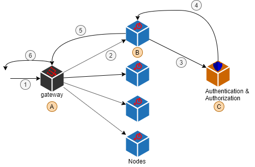

ontimize-cloud-security
=======================
#Introducción
El objetivo de este módulo es dar soporte a la autenticación centralizada en una arquitectura de microservicios.
El esquema en el que nos vamos a basar es el que se muestra en las siguiente imagen.



Tenemos un gateway (A) que recibe todas las peticiones de los clientes y se redirigen a cada nodo de servicio (B).
Cada nodo (B) que recibe una petición se conectará contra el nodo de autenticación (C) para comprobar la cabecera *Authorization* de la request HTTP.
Cada vez que el nodo vaya ejecutar un método *@Secured* se conectará con el nodo de autorización para comprobar si el usuario tiene permisos.

#Funcionamiento
**Escenario:** un cliente quiere ejecutar un método publicado por uno de los servicios que exponen nuestros nodos de servicio (B) a través del gateway (A) de forma autenticada.

Para ello realiza una petición HTTP (REST/SOAP/HESSIAN/...) con la cabecera `Authorization` (por defecto ontimize-cloud soporta Basic y Bearer).
 
La petición llega al proxy (A) que en base al path de la petición la redirije al nodo de servicio (B) correspondiente.
El nodo de servicio (B) tiene el filtro de seguridad configurado de tal forma que realizará una petición al nodo de autenticación (C) para conocer los detalles del usuario. Esta petición será la que lo autentique.
Esto se consigue configurando en el `application.yml` del nodo de servicio (B) la propiedad `ontimize.security.mode=centralized`.
Esta configuración hace que en el filtro de autenticación haga una llamada *Feign* copiando la cabecera `Authorization` de (1) a (3) ya que el servicio de Autenticación (C) implementa la siguiente API REST ( debe implementarse en el servidor de seguridad de la red de microservicios objetivo):
```java
import org.springframework.cloud.openfeign.FeignClient;
import org.springframework.http.MediaType;
import org.springframework.web.bind.annotation.PathVariable;
import org.springframework.web.bind.annotation.RequestMapping;
import org.springframework.web.bind.annotation.RequestMethod;

import com.ontimize.cloud.security.centralized.ICentralizedAuthProvider;
import com.ontimize.cloud.security.centralized.UserInformationDto;
import com.ontimize.cloud.security.centralized.feign.FeignConfigurationAuth;
import com.ontimize.jee.common.exceptions.OntimizeJEEException;

@FeignClient(name = "mar-auth", contextId = "mar-auth.auth", path = "/authapi", configuration = FeignConfigurationAuth.class)
public interface IAuthApi extends ICentralizedAuthProvider {

	@Override
	@RequestMapping(value = "/getUserInformation", method = RequestMethod.GET, produces = MediaType.APPLICATION_JSON_VALUE)
	UserInformationDto getUserInformation() throws OntimizeJEEException;

	@Override
	@RequestMapping(value = "/hasPermission/{permissionName}", method = RequestMethod.GET, produces = MediaType.APPLICATION_JSON_VALUE)
	Boolean hasPermission(@PathVariable("permissionName") String permissionName);

	@Override
	@RequestMapping(value = "/requestToken", method = RequestMethod.GET, produces = MediaType.APPLICATION_JSON_VALUE)
	String requestToken();

	@Override
	@RequestMapping(value = "/invalidateCache", method = RequestMethod.GET, produces = MediaType.APPLICATION_JSON_VALUE)
	void invalidateCache();
}
```
Nótese que el API implementa la interfaz `com.ontimize.cloud.security.centralized.ICentralizedAuthProvider` y que la propiedad `configuration` de la anotación `@FeignClient` está establecida a `com.ontimize.cloud.security.centralized.feign.FeignConfigurationAuth`.
En la petición (3) que se hace del nodo de servicio (B) al nodo de autenticación (C) es necesario inyectar la cabecera `Authorization`, esto se hace con la siguiente configuración en el `application.yml` del nodo de servicio (B):

```yaml
feign:  
  client: 
    config: 
      default:      
         requestInterceptors:
           - com.ontimize.cloud.security.centralized.feign.FeignSecurityHeaderRequestInterceptor
```

Si la petición de los datos del usuario tiene éxito en el servidor de autenticación (C), es decir, la cabecera `Authorization` pasa el filtro de seguridad de este nodo (C), si se utiliza la configuración por defecto de seguridad ontimize, el nodo (C) devolverá el token JWT en la cabecera HTTP `XX-Auth-Token`.
Ese token se inyecta en la respuesta (5) (ver `SecurityInterceptorFeignClient`).

Una vez se pasa el filtro de seguridad en el nodo de servicio (B), esto es, la petición al nodo de autenticación (C) devuelve la información del usuario, comienza la llamada a los métodos del servicio. 
En caso de que exista un método anotado como `@Secured` el `CentralizedSecurityAuthorizator` que se instala por defecto en el nodo de servicio (B) con el `CentralizedSecurityAutoConfiguratio` realizará otra petición al nodo de autorización (C) mediante un objeto que cumpla la interfaz `ICentralizedAuthProvider` (que debería ser un objeto Feign).
